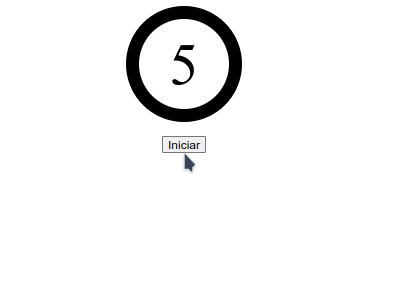
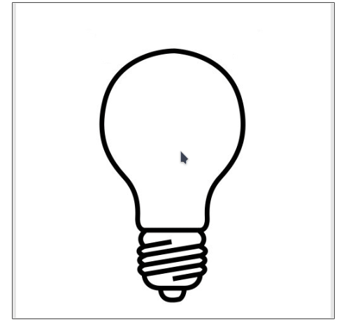
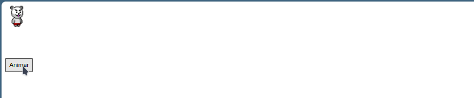

# Coletânea de projetos de efeitos de animação com Javascript

## 📖 Descrição

Esse repositório conta com diferentes projetos que usam efeitos de animações com Javascript. Aqui encontra-se um projeto de temporizador, lâmpada que acende e um urso que caminha.

## 📡 Tecnologias utilizadas

 

  

## ⏳ Inicialização

Os projetos usam apenas HTML, CSS e Javascript puros. 

Existem várias formas de executar o projeto, uma delas é usar a extensão [Live Server](https://marketplace.visualstudio.com/items?itemName=ritwickdey.LiveServer&ssr=false#review-details) do VS Code. 

 

 

## 🤵🤵‍♀️ Colaboradores

O único colaborador desse projeto fui eu (Eduardo Vítor).

 

## 🔎 Status do Projeto

 

## 📑 Referências

[HTML](https://developer.mozilla.org/pt-BR/docs/Web/HTML)

[CSS](https://developer.mozilla.org/pt-BR/docs/Web/CSS)

[Javascript](https://developer.mozilla.org/pt-BR/docs/Web/JavaScript)

